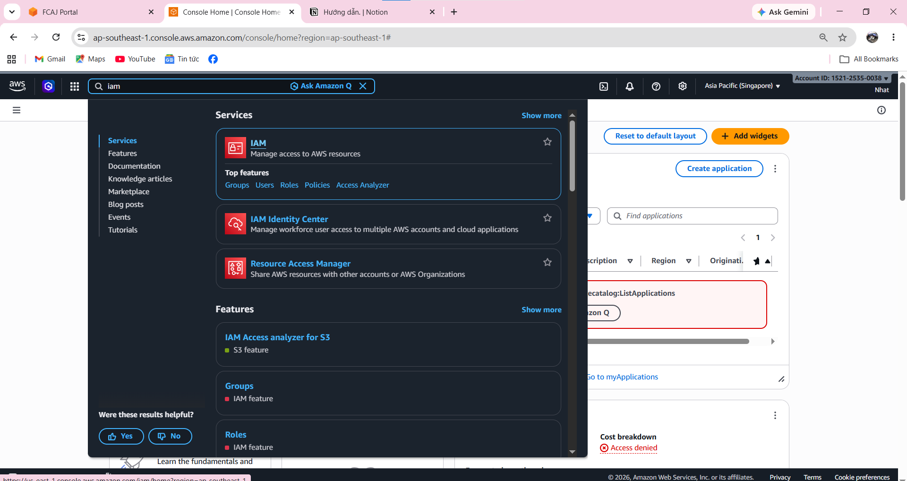
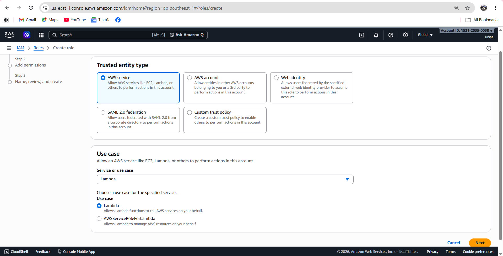
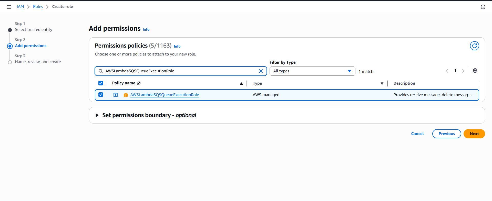
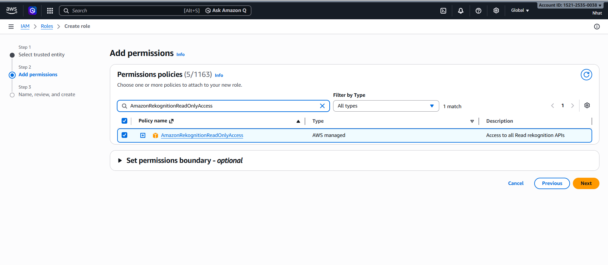

# Step 1: Preparing IAM Role for Lambda

### Introduction

IAM Role is the permission that Lambda uses to access necessary AWS services in the workshop such as Amazon S3, Amazon SQS, Amazon Rekognition, and Amazon Textract.

In this step, you will create an IAM Role for Lambda and attach necessary policies so Lambda can read data, receive messages, and write logs during image processing.

---

### Implementation Steps

1. Access the **AWS Console**, find the **IAM** service.

2. Select **Roles**, then select **Create role**.

3. In the **Trusted entity type** section, select **AWS service**.

4. In the **Use case** section, select **Lambda**, then select **Next**.

5. Find and attach the necessary policies for Lambda in sequence.

6. Name the role **Lambda-ImageProcessing-Role**, then select **Create role**.

---

### Security Notes

In production environments, instead of using AWS's built-in policies, you should write your own **Custom Policy** to limit permissions only to specific buckets or queues.

This is a security best practice following the **Least Privilege** principle, which means granting only necessary permissions and avoiding excessive permissions.

