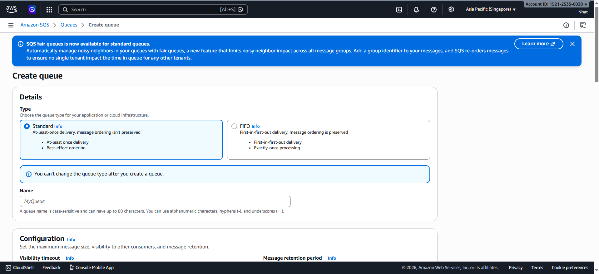
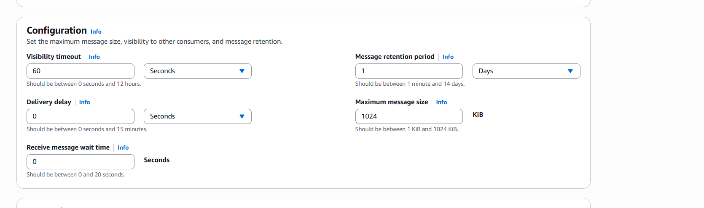

# Step 2: Creating Amazon SQS Message Queue

### Introduction

Amazon SQS acts as an intermediate queue between Amazon S3 and AWS Lambda.

When users upload images to S3, S3 sends a notification to SQS. Lambda reads messages from SQS and processes them gradually, helping the system remain stable when many images are uploaded simultaneously.

---

### Implementation Steps

1. Access the **AWS Console**, find the **Amazon SQS** service, then select **Create queue**.

2. Select queue type as **Standard Queue**.

Don't select **FIFO Queue** in this workshop because the goal is to process images asynchronously with high scalability, without requiring strict message ordering.

3. Name the queue **image-processing-queue**.

4. Configure important parameters for the queue.

5. Select **Create queue** to create the queue.

6. After creation, copy the **ARN** of the queue. This ARN will be used in the S3 Event Notification configuration step.

