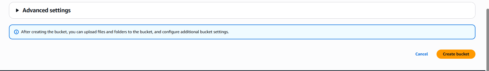
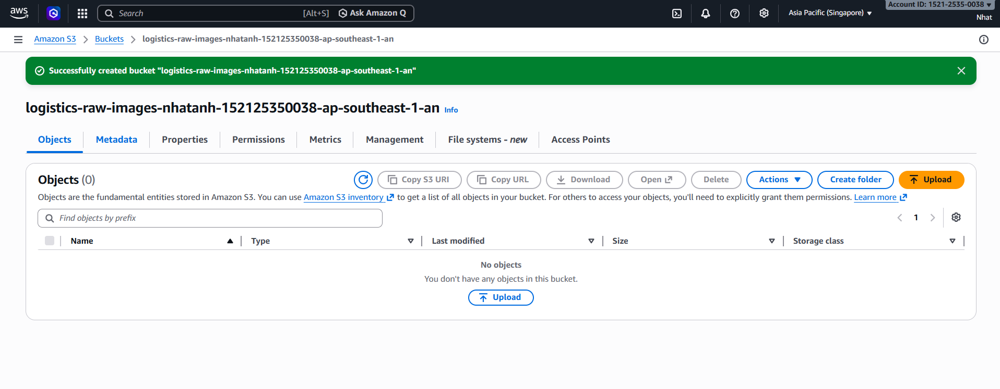
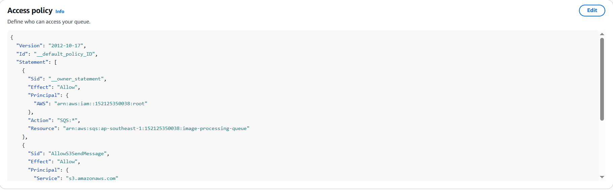
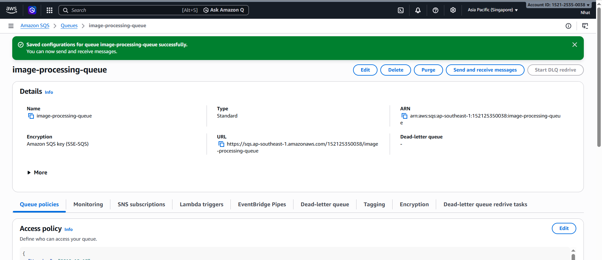
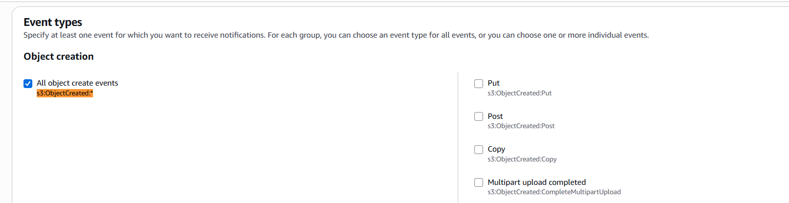
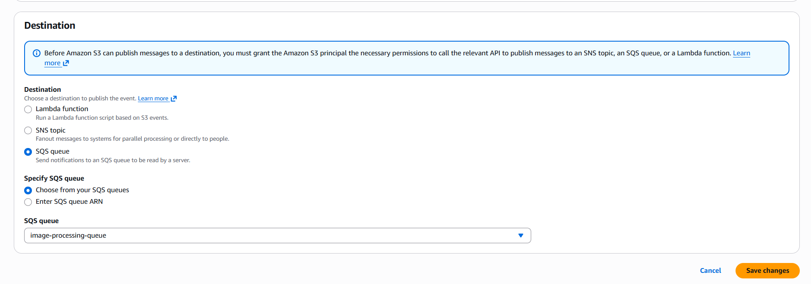
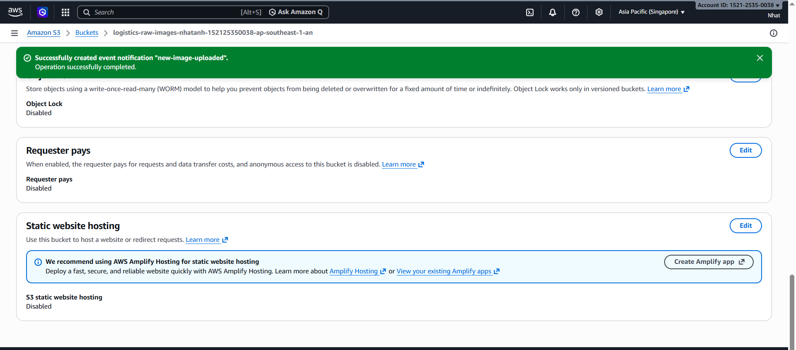

# Step 3: Configuring Storage and Events in Amazon S3

### Objective

In this step, you will create an S3 bucket to store images and configure it so that whenever a new image is uploaded, Amazon S3 automatically sends a notification to the SQS queue created in the previous step.

---

### 3.1 - Creating S3 Bucket

1. Access **Amazon S3**, then select **Create bucket**.


2. Name the bucket in the format **logistics-raw-images-&lt;your-name&gt;**.

The bucket name must be unique across all of AWS.


3. Select Region **ap-southeast-1 (Singapore)** to be closer to Vietnam.


4. Keep default settings, then select **Create bucket**.





---

### 3.2 - Granting Permission for S3 to Send Notifications to SQS

1. Go to **SQS Console**, select the queue **image-processing-queue**.

2. Open the **Access policy** tab, select edit policy.

3. Add a policy allowing S3 to send messages to SQS.



Example policy:

```json
{
  "Version": "2012-10-17",
  "Statement": [
    {
      "Effect": "Allow",
      "Principal": {
        "Service": "s3.amazonaws.com"
      },
      "Action": "sqs:SendMessage",
      "Resource": "arn:aws:sqs:ap-southeast-1:<account-id>:image-processing-queue",
      "Condition": {
        "ArnLike": {
          "aws:SourceArn": "arn:aws:s3:::logistics-raw-images-<your-name>"
        }
      }
    }
  ]
}
```

Replace **&lt;account-id&gt;** with your AWS Account ID and replace **logistics-raw-images-&lt;your-name&gt;** with your bucket name.



---

### 3.3 - Configuring S3 Event Notification

1. Go to the bucket you just created, open the **Properties** tab, scroll down to the **Event notifications** section, then select **Create event notification**.


2. Name the event **new-image-uploaded**.


3. In the **Event types** section, check **s3:ObjectCreated:***.



4. In the **Prefix/Suffix** section, enter image suffixes such as **.jpg**, **.jpeg**, **.png** to only trigger when images are uploaded.

This configuration helps skip non-image files like `.txt` or `.pdf`.


5. In the **Destination** section, select **SQS Queue**, then select the queue **image-processing-queue**.



6. Select **Save changes** to save the configuration.


