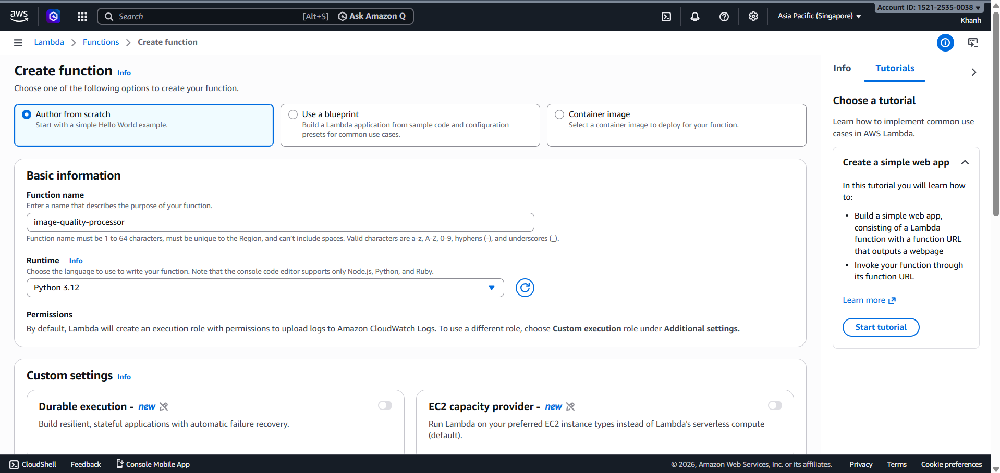
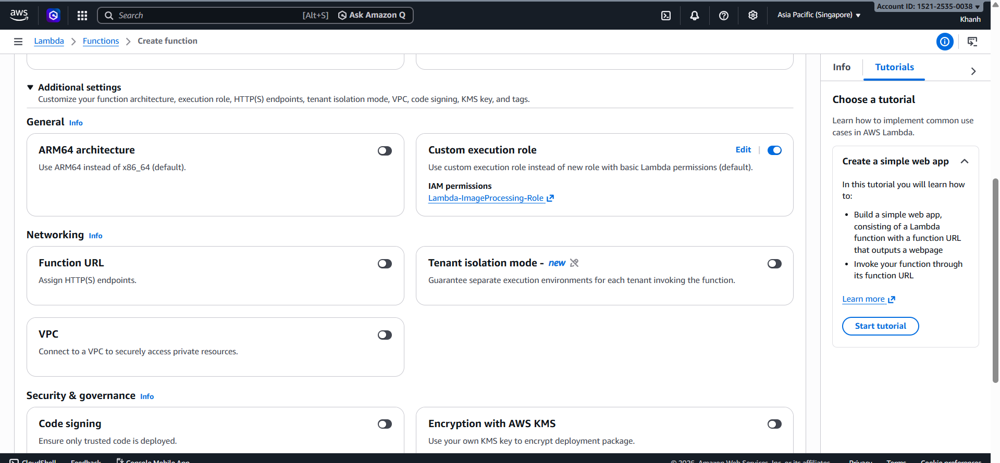
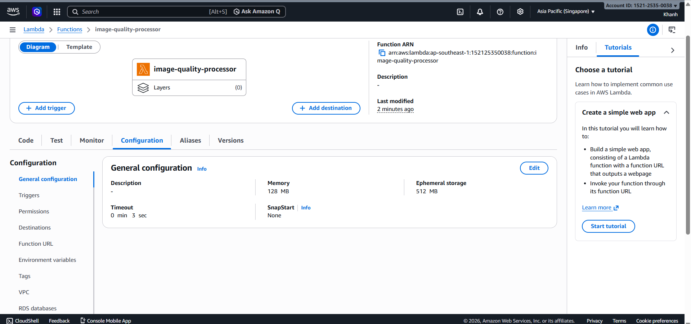
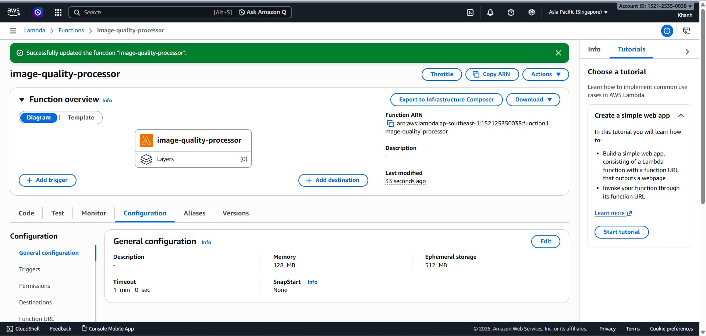
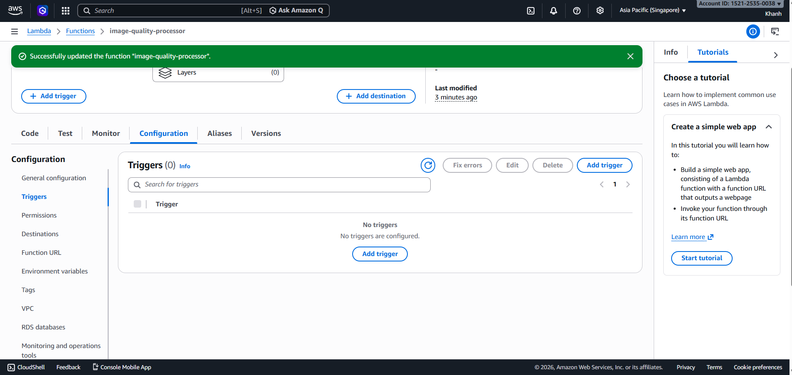

# Bước 4: Tạo và viết code cho AWS Lambda

### Mục tiêu

Trong bước này, bạn sẽ tạo Lambda Function để nhận message từ Amazon SQS, đọc thông tin ảnh được upload lên Amazon S3 và gọi các dịch vụ AI như Amazon Rekognition và Amazon Textract để phân tích ảnh.

---

### 4.1 - Tạo Lambda Function

1. Truy cập **AWS Lambda**, chọn **Create function**.


2. Chọn **Author from scratch**.


3. Cấu hình Lambda Function.





Gợi ý cấu hình:

- Function name: **image-quality-processor**
- Runtime: **Python 3.x**
- Execution role: chọn IAM Role **Lambda-ImageProcessing-Role** đã tạo ở bước 1

4. Chọn **Create function**.


5. Vào tab **Configuration**, chọn **General configuration**, sau đó chọn **Edit**.



6. Đặt **Timeout = 60 giây**, sau đó lưu cấu hình.



---

### 4.2 - Gắn SQS làm Trigger

1. Ở trang Lambda Function, chọn **Add trigger**.



2. Chọn source là **SQS**.


3. Chọn queue **image-processing-queue**.

4. Cấu hình **Batch size = 1**.

Batch size bằng 1 giúp Lambda xử lý từng message một, phù hợp cho lab vì dễ quan sát log và debug.

5. Chọn **Add**.


---

### 4.3 - Viết code Python

1. Vào tab **Code**.

2. Xóa code mẫu, dán đoạn code Python xử lý SQS message, sau đó chọn **Deploy** để lưu code.


Code mẫu:

```python
import json
import urllib.parse

import boto3

s3 = boto3.client("s3")
rekognition = boto3.client("rekognition")
textract = boto3.client("textract")


def lambda_handler(event, context):
    for record in event["Records"]:
        body = json.loads(record["body"])

        for s3_record in body.get("Records", []):
            bucket = s3_record["s3"]["bucket"]["name"]
            key = urllib.parse.unquote_plus(s3_record["s3"]["object"]["key"])

            print(f"Processing image: s3://{bucket}/{key}")

            labels = rekognition.detect_labels(
                Image={
                    "S3Object": {
                        "Bucket": bucket,
                        "Name": key
                    }
                },
                MaxLabels=10,
                MinConfidence=70
            )

            print("Rekognition labels:")
            for label in labels["Labels"]:
                print(f"- {label['Name']}: {label['Confidence']:.2f}%")

            text_result = textract.detect_document_text(
                Document={
                    "S3Object": {
                        "Bucket": bucket,
                        "Name": key
                    }
                }
            )

            print("Textract text:")
            for block in text_result["Blocks"]:
                if block["BlockType"] == "LINE":
                    print(block["Text"])

    return {
        "statusCode": 200,
        "body": "Processed SQS messages successfully"
    }
```
