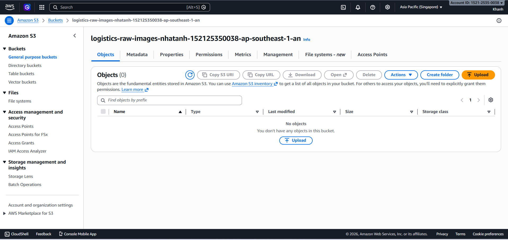

# Step 5: System Testing

### Objective

Verify that the entire **S3 -> SQS -> Lambda -> AI** pipeline works correctly.

In this step, you will upload images to S3, check Lambda processing messages from SQS, and view analysis results in CloudWatch Logs.

---

### 5.1 - Preparing Test Images

Prepare at least 2 types of images:

- Images of packages that are dented or torn to check if Amazon Rekognition correctly detects image content.
- Images with shipping labels containing clear shipment codes to check if Amazon Textract correctly extracts text.

---

### 5.2 - Uploading Images to S3

1. Go to S3 bucket **logistics-raw-images-&lt;your-name&gt;**, then select **Upload**.

2. Upload approximately **5-10 images** at once to test parallel processing capability.

3. Select **Upload** to start uploading images.

---

### 5.3 - Checking CloudWatch Logs

1. Access **CloudWatch**, select **Log groups**.

2. Find the log group **/aws/lambda/image-quality-processor**.

3. Select the latest log stream and check Lambda output.

---

### 5.4 - Verifying SQS Queue is Empty

1. Go to **SQS Console**, select the queue **image-processing-queue**.

2. Select **Send and receive messages**.

3. Select **Poll for messages**.

If the queue is empty, it means Lambda has successfully processed all messages.

