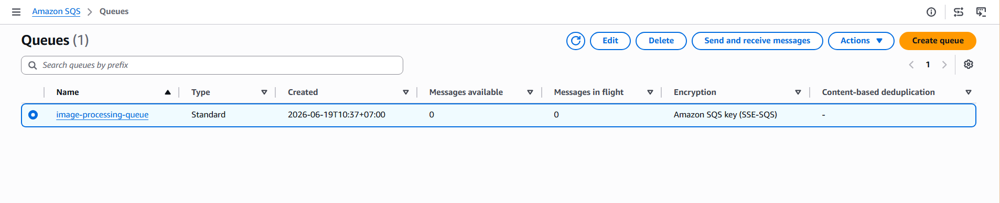
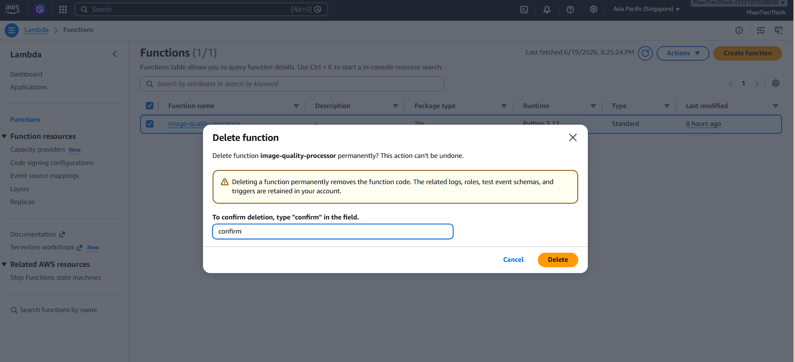
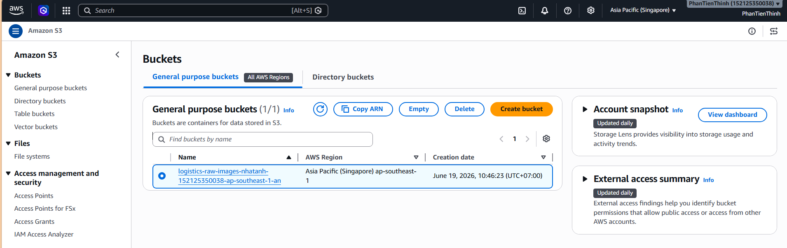
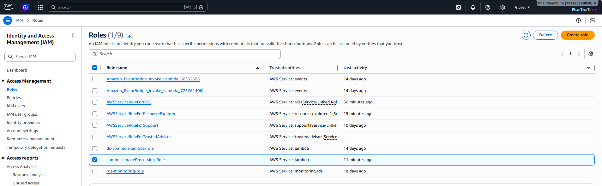

# Step 6: Cleaning Up Resources

### Objective

After completing the workshop, you need to delete the resources you created to avoid unexpected costs.

---

### 1. Deleting SQS Queue

1. Access **Amazon SQS**.

2. Select the queue created in the workshop, then select **Delete**.

3. Enter **Confirm** to confirm queue deletion.

---

### 2. Deleting Lambda Function

1. Access **AWS Lambda**.

2. Select the function created in the workshop, then select **Delete**.

3. Enter confirmation to delete the function.

---

### 3. Deleting S3 Bucket

1. Access **Amazon S3**.

2. Go to the bucket created in the workshop.

3. Select the bucket to delete, then select **Delete**.

Note: The S3 bucket must be emptied before deletion. If the bucket contains objects, delete all objects in the bucket first.

---

### 4. Deleting IAM Role

1. Access **IAM**.

2. Select **Roles**.

3. Select the IAM Role **Lambda-ImageProcessing-Role** created in the workshop, then delete the role.

