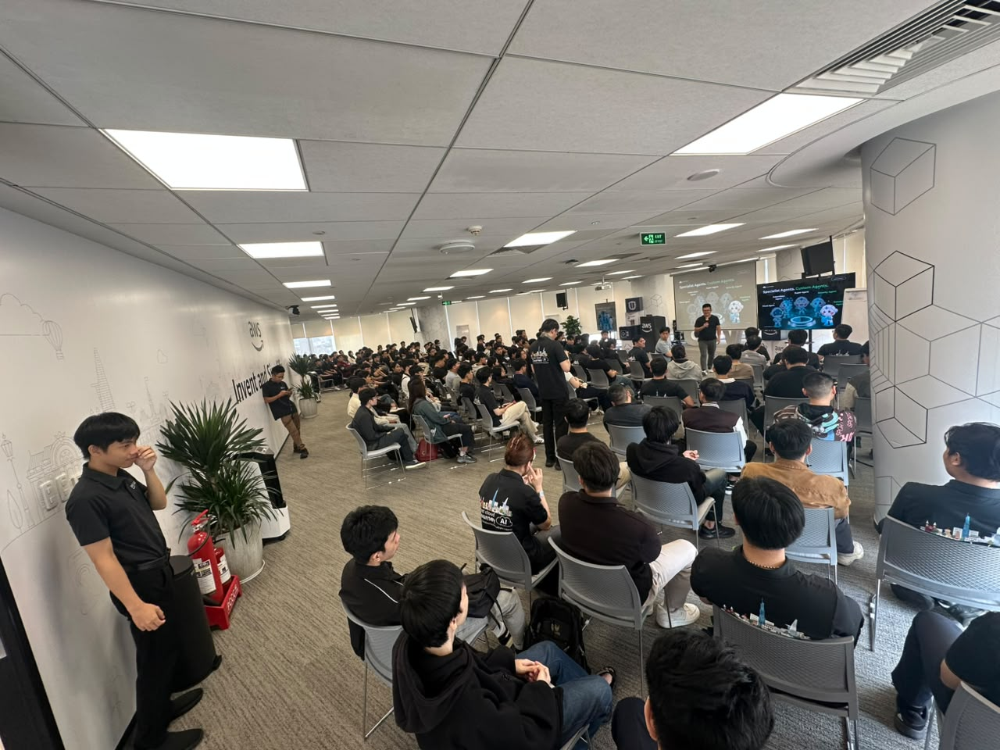

# Reflection on “FCAJ Community Day”

### Event Purpose

- Share best practices for operating cloud systems with AI support
- Introduce the latest AI agent, voice agent, and DevOps agent solutions from AWS
- Guide the application of AI to operations, HR, and security system integration challenges
- Connect the technology community with experts and practical solutions from AWS

### Speaker List

- **Huynh Hoang Long** - Event host
- Together with invited speakers from AWS and the technology community
- Truong Tran - AI Solution Sales, Noventiq
- Steve Tran - CTO/Founder, CloudThinker
- Trung Vu - CEO, Revve AI
- Anh Dang - Solution Sales, Noventiq
- Nghi Danh - AI Engineer, Renova Cloud
- Kiet Tran - AI Engineer, AWS Student Builder Group
- Bao Phan - Cloud Engineer, Cloud Kinetics
- Nguyen Nguyen - Cloud Engineer, Cloud Kinetics
- Toan Nguyen - AWS Security Builder

### Highlights

#### Deep Response Engine: From Detection to Autonomous Resolution

- The complexity of modern cloud operations
- Moving from alert-driven systems to action-driven systems
- Overview of the Deep Response Engine architecture
- Live demo of autonomous incident response
- Business impact: lower costs and zero-downtime operations

#### Voice Agents: Building Human-Like AI Conversations at Scale

- The development journey from IVR and chatbots to AI voice agents
- Main challenges: latency, accuracy, and natural interaction
- Amazon Nova Sonic and the speech-to-speech foundation model
- Architecture: telephony, streaming, Bedrock, MCP tools
- Enterprise use cases, best practices, and live demo

#### AWS DevOps Agent: Your Always-Available Operations Teammate

- Overview of the AWS DevOps Agent
- Reduced MTTD and MTTR through AI-driven operations
- Support for multi-cloud and hybrid environments
- Bedrock AgentCore and the multi-agent reasoning approach
- Real-world use cases and deployment demo on ECS

#### AI-Powered Productivity: Workforce Planning for Enterprise

- Digital transformation challenges in HR at modern enterprises
- Overview of Amazon Quick and its features for HR
- Accelerating HR operations through automation
- Workforce analysis and data-driven insights
- Strategic human resource planning for enterprise decision-making

#### Building Secure Private MCP Connection with Amazon Quick

- Introduction to Amazon Quick as an AI assistant platform
- MCP (Model Context Protocol) and its role in scalability
- Security challenges in MCP-based integration
- Private connectivity configuration (VPC) for Amazon Quick
- Demo and practical implementation lessons

### What I Learned

#### Operating Systems with AI

- **From alert-driven to action-driven**: understanding how modern systems are shifting from merely alerting to automatically handling incidents
- **Reducing MTTD/MTTR**: learning how AI agents help shorten detection and resolution time for operations
- **Multi-cloud & hybrid**: understanding how AI operations solutions can be applied across multiple environments

#### Voice Agents and AI Communication

- **Speech-to-speech foundation model**: learning about Amazon Nova Sonic and the architecture behind voice agents
- **Latency and accuracy challenges**: identifying technical factors to consider when building natural conversational experiences
- **Integration architecture**: how telephony, streaming, Bedrock, and MCP tools work together

#### AI Applications in HR and Security

- **Amazon Quick for HR**: how automation and data analysis can accelerate HR operations
- **Security in MCP**: understanding the challenges and how to configure private connectivity (VPC) when integrating AI assistants into enterprise systems

### Application to Work

- **Apply an action-driven mindset**: consider moving some current alert-driven processes to automated incident handling
- **Experiment with voice agents**: evaluate the feasibility of applying Amazon Nova Sonic to customer care use cases
- **Integrate the DevOps Agent**: pilot the AWS DevOps Agent to support current system operations
- **Apply Amazon Quick for HR**: propose testing workforce analytics features for HR operations
- **Prioritize MCP security**: refer to VPC private connectivity configuration when integrating AI assistants into internal systems

### Experience in the Event

Participating in “FCAJ Community Day” was a valuable experience that helped me stay updated on the latest AI solutions for system operations, voice interaction, and HR management. Some of the highlights were:

#### Learning from Highly Skilled Speakers
- I had the chance to listen directly to experts talk about **Deep Response Engine** and how modern systems automate incident handling.
- Through live demos, I gained a clearer understanding of how **AWS DevOps Agent** helps operations teams reduce detection and resolution time.

#### Practical Technical Experience
- I learned about **Amazon Nova Sonic** and the architecture behind building voice agents that can converse naturally at scale.
- I explored how **Amazon Quick** supports workforce planning and HR data analysis.
- I gained a better understanding of how to configure **private MCP connectivity (VPC)** to ensure security when integrating AI assistants.

#### Applying Modern Tools
- I directly learned about the **Bedrock AgentCore** architecture and the multi-agent reasoning approach in operations.
- I recognized the potential of applying AI agent solutions to reduce repetitive work for operations and HR teams.

#### Networking and Discussion
- The event created opportunities to exchange ideas directly with speakers and the technology community about AI agent solutions in practice.
- Through the demos, I gained more insight into how to deploy AI agents safely and effectively in enterprises.

#### Lessons Learned
- Moving from alert-driven to action-driven operations helps reduce downtime and improve incident response efficiency.
- Voice agents and AI assistants are becoming increasingly important in customer experience and internal operations.
- Security must be prioritized when integrating AI agents through MCP into enterprise systems.

#### Some Photos from the Event
* Add photos of your friends here

> Overall, the event not only provided technical knowledge about AI agents and cloud operations, but also gave me more ideas for applying AI to my current work in a more effective and safer way.
